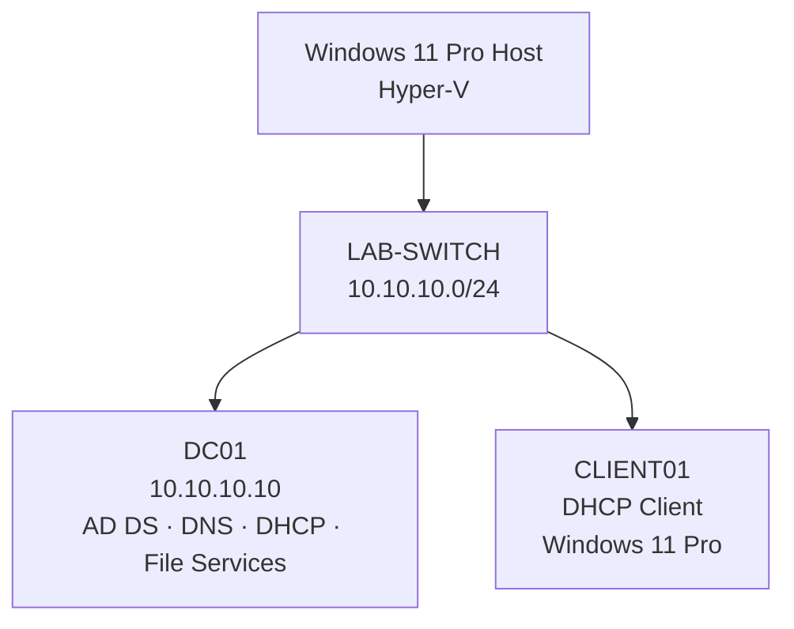
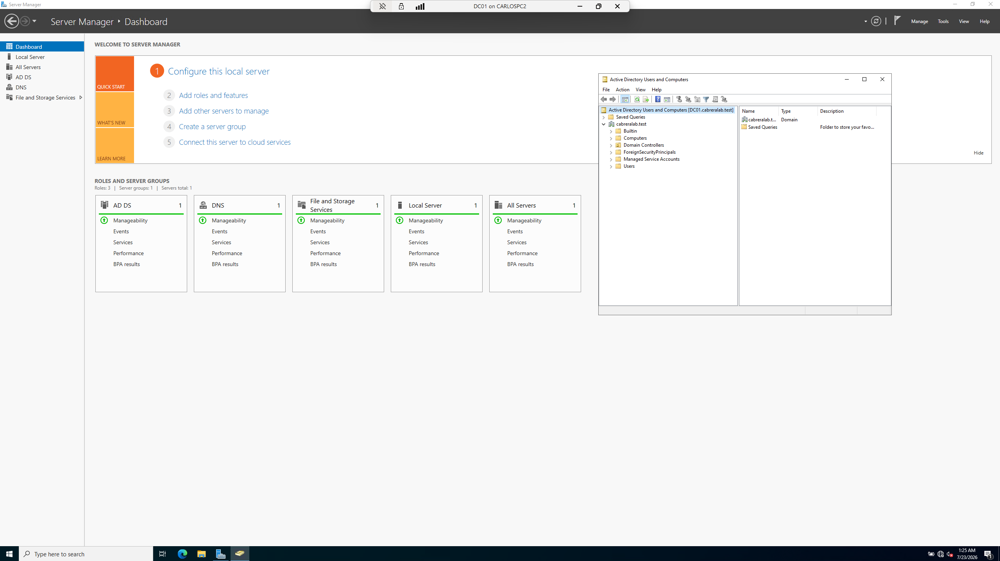
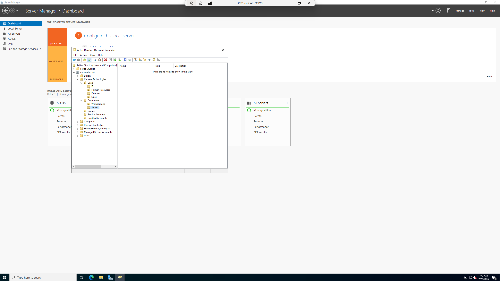
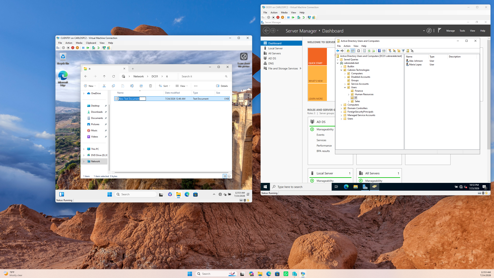
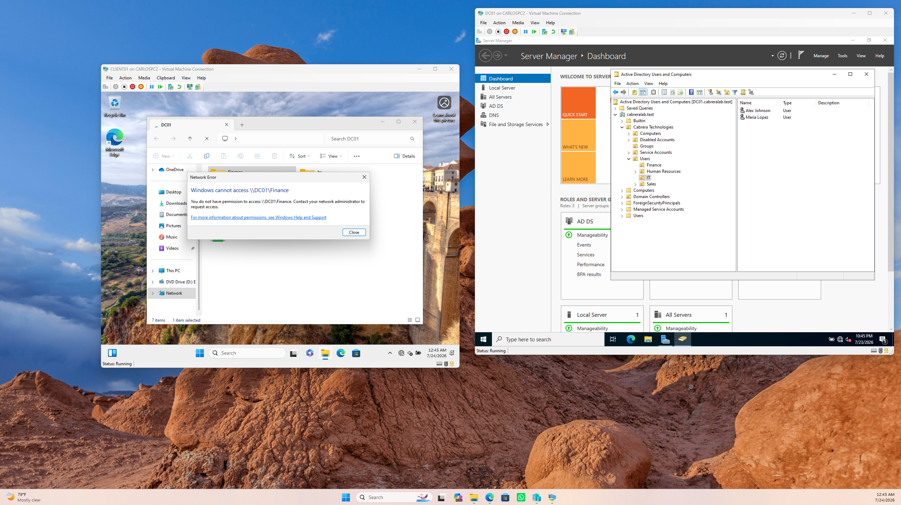
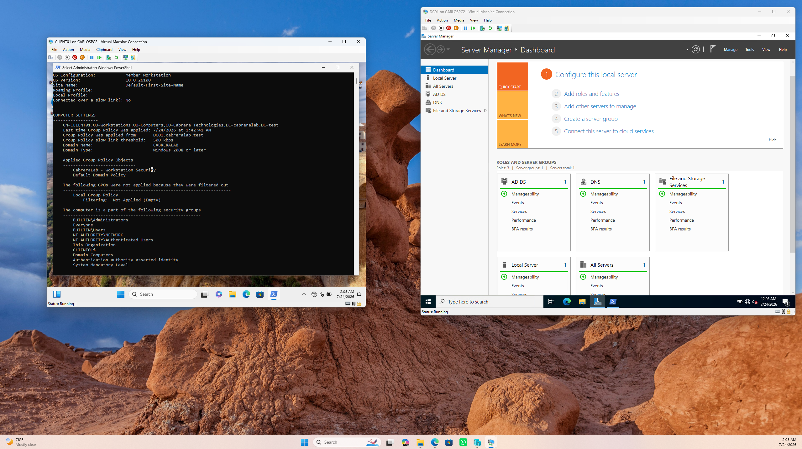
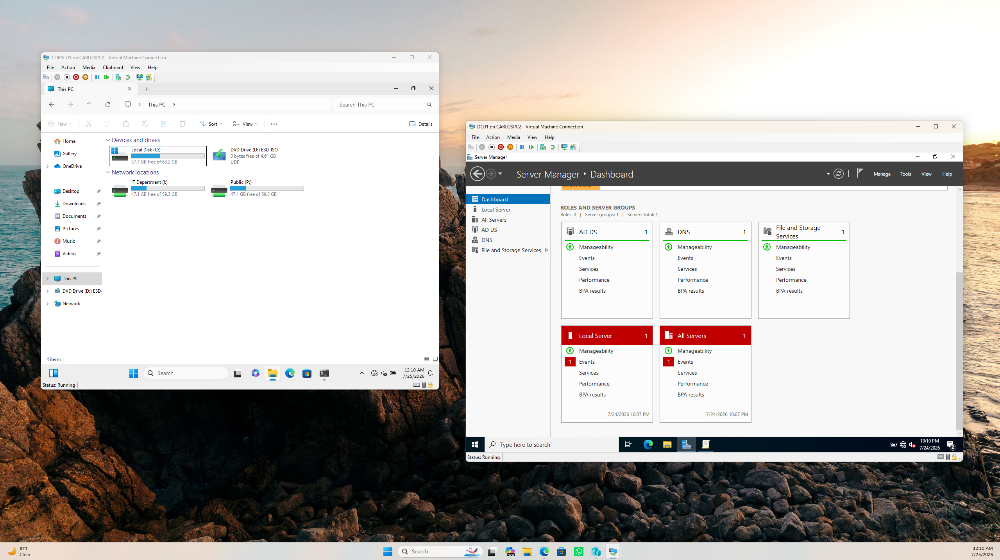
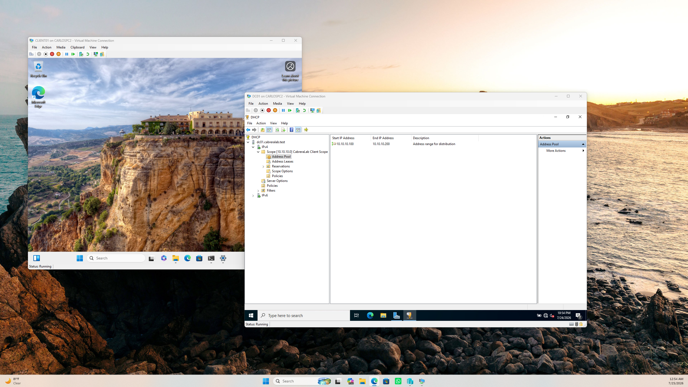
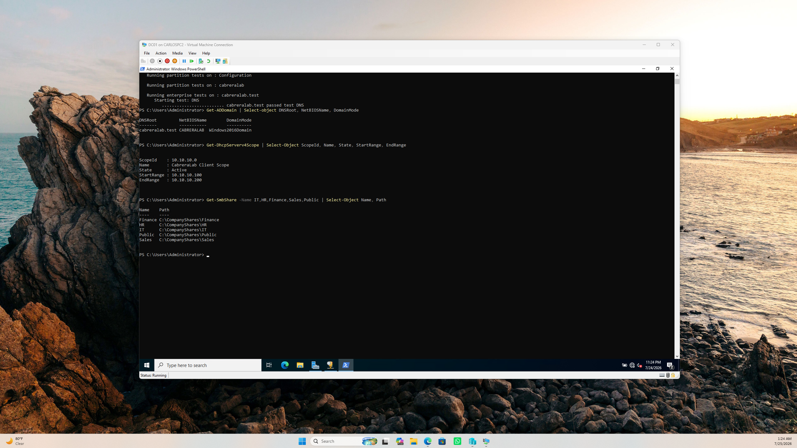

# Active Directory Home Lab


## Overview

This project demonstrates the deployment and administration of a small business
Windows domain in a virtualized home-lab environment. I built the environment
from the ground up using Hyper-V, Windows Server 2022, Windows 11 Pro, Active
Directory Domain Services, DNS, DHCP, Group Policy, SMB shares, and NTFS
permissions.

The fictional organization used for the lab is **Cabrera Technologies**, with
the internal domain **cabreralab.test**.

## Objectives

- Deploy a Windows Server 2022 domain controller.
- Configure a private Hyper-V network for the lab.
- Install and configure Active Directory Domain Services and DNS.
- Design an organizational unit structure for a small business.
- Create departmental users and security groups.
- Apply least-privilege SMB and NTFS permissions.
- Join a Windows 11 Pro workstation to the domain.
- Deploy security settings and mapped drives through Group Policy.
- Configure DHCP for automatic client addressing.
- Reproduce, diagnose, and resolve a DNS configuration problem.

## Lab Architecture



## Environment

| Component | Configuration |
|---|---|
| Hypervisor | Microsoft Hyper-V |
| Domain controller | DC01 — Windows Server 2022 Standard Evaluation |
| Client | CLIENT01 — Windows 11 Pro |
| Domain | cabreralab.test |
| NetBIOS name | CABRERALAB |
| Network | 10.10.10.0/24 |
| Server address | 10.10.10.10 |
| DHCP scope | 10.10.10.100–10.10.10.200 |
| Client DNS | 10.10.10.10 |

## Implementation

The lab was deployed from the ground up using the following workflow:

1. Created the virtual lab environment in Hyper-V.
2. Deployed Windows Server 2022 as `DC01`.
3. Configured a static IP address and internal lab networking.
4. Installed Active Directory Domain Services and DNS.
5. Promoted `DC01` to a domain controller for `cabreralab.test`.
6. Created the organizational unit structure, users, and security groups.
7. Configured departmental SMB shares and NTFS permissions.
8. Created and linked Group Policy Objects for workstation security and drive mapping.
9. Installed and configured DHCP for automatic client addressing.
10. Deployed `CLIENT01` with Windows 11 Pro and joined it to the domain.
11. Tested domain authentication, Group Policy, drive mapping, permissions, DHCP, and DNS.
12. Simulated and resolved a client DNS configuration issue.

## Active Directory Design

```text
Cabrera Technologies
├── Users
│   ├── IT
│   ├── Human Resources
│   ├── Finance
│   └── Sales
├── Computers
│   ├── Workstations
│   └── Servers
├── Groups
├── Service Accounts
└── Disabled Accounts
```

Global security groups were created for role-based access:

- `GG_IT_Users`
- `GG_HR_Users`
- `GG_Finance_Users`
- `GG_Sales_Users`
- `GG_HelpDesk_Tier1`

## File Services and Access Control

Departmental SMB shares were created on DC01:

| Share | Authorized group | NTFS access |
|---|---|---|
| `\\DC01\IT` | GG_IT_Users | Modify |
| `\\DC01\HR` | GG_HR_Users | Modify |
| `\\DC01\Finance` | GG_Finance_Users | Modify |
| `\\DC01\Sales` | GG_Sales_Users | Modify |
| `\\DC01\Public` | Domain Users | Modify |

`SYSTEM` and `Administrators` retain Full Control. Departmental users receive
Modify instead of Full Control so they cannot change permissions or ownership.

## Group Policy

The following policies were implemented:

### Workstation Security

- Machine inactivity limit: 600 seconds.
- Guest account disabled.
- Linked to the Workstations OU.

### Domain Password Policy

- Password history: 5 passwords.
- Maximum password age: 90 days.
- Minimum password age: 1 day.
- Minimum password length: 10 characters.
- Complexity requirements enabled.
- Account lockout after 5 invalid attempts.
- Lockout duration and reset counter: 15 minutes.

### Department Drive Maps

Group Policy Preferences and item-level targeting automatically map:

| Group | Drive |
|---|---|
| Domain Users | `P:` → `\\DC01\Public` |
| GG_IT_Users | `I:` → `\\DC01\IT` |
| GG_HR_Users | `H:` → `\\DC01\HR` |
| GG_Finance_Users | `F:` → `\\DC01\Finance` |
| GG_Sales_Users | `S:` → `\\DC01\Sales` |

For example, an IT user receives only the Public and IT drives.

## DHCP and DNS

DC01 provides DHCP leases from `10.10.10.100` through `10.10.10.200`. Clients
receive `10.10.10.10` as their DNS server, allowing them to locate domain
services and resolve `cabreralab.test`.

The configuration was validated using:

```powershell
ipconfig /all
nslookup cabreralab.test
dcdiag /test:dns
Get-DhcpServerv4Scope
```

## Troubleshooting Scenario

### Client Could Not Resolve the Internal Domain

**Symptoms**

- `CLIENT01` could not resolve `cabreralab.test`.
- Domain resources were unavailable.

**Cause**

The client was configured to use a public DNS server. Public DNS servers do not
contain records for the private Active Directory domain.

**Resolution**

1. Restored automatic DNS configuration from DHCP.
2. Flushed the local DNS cache.
3. Released and renewed the DHCP lease.
4. Verified that the client received `10.10.10.10` as DNS.
5. Confirmed successful domain resolution.

```powershell
ipconfig /flushdns
ipconfig /release
ipconfig /renew
nslookup cabreralab.test
```

## Validation

The completed environment was validated by:

- Joining CLIENT01 to `cabreralab.test`.
- Signing in with a domain user.
- Confirming that Group Policy applied successfully.
- Verifying automatic drive mapping based on group membership.
- Confirming access to authorized shares.
- Confirming Access Denied for unauthorized departmental shares.
- Confirming a valid DHCP lease and internal DNS resolution.
- Running a successful domain controller DNS health check.

## Skills Demonstrated

- Windows Server administration
- Active Directory Domain Services
- DNS and DHCP
- Hyper-V virtualization
- TCP/IP configuration and troubleshooting
- Organizational units and identity administration
- Security groups and role-based access control
- SMB shares and NTFS permissions
- Group Policy Objects and Group Policy Preferences
- Windows domain joins
- PowerShell and command-line diagnostics
- Technical documentation

## Evidence

Selected screenshots demonstrating the deployment, configuration, and validation
of the Active Directory environment. The complete set of implementation evidence
is available in the [`screenshots`](screenshots/) directory.

### Active Directory Domain

The `cabreralab.test` domain was successfully deployed on DC01 using Windows
Server 2022 and Active Directory Domain Services.



### Organizational Unit Structure

Organizational Units were created to separate users, computers, departments,
service accounts, and disabled accounts.



### Domain-Joined Windows 11 Client

CLIENT01 was successfully joined to the `cabreralab.test` domain.


### Domain User Authentication

Domain authentication was validated by signing in to CLIENT01 using a domain
user account.


### Access Control Validation

Departmental permissions were tested to verify that authorized users could
access their assigned resources while unauthorized access was denied.





### Group Policy and Drive Mapping

Group Policy was successfully applied to CLIENT01, including automatic
departmental drive mapping based on security group membership.





### DHCP Configuration

DC01 was configured as the DHCP server for the lab network.



### DNS Troubleshooting

A DNS misconfiguration was intentionally reproduced and resolved to demonstrate
a common Active Directory troubleshooting scenario.


### Final Validation

Final testing confirmed that Active Directory, DNS, DHCP, Group Policy,
authentication, permissions, and domain services were functioning correctly.



## Author

**Carlos Cabrera**  
CompTIA A+ Certified | IT Support and Systems Administration

